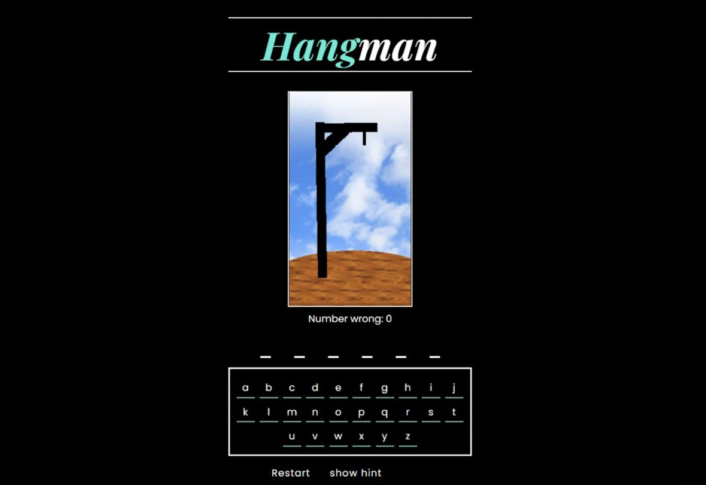
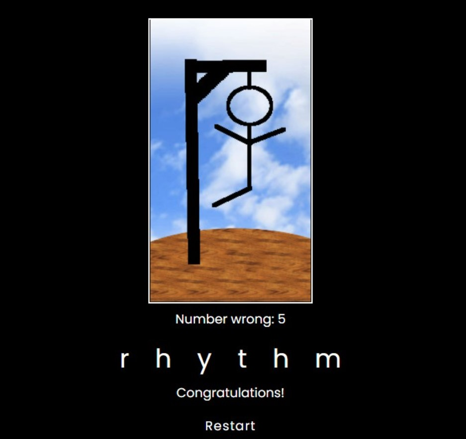

## Hangman

<b>Built with</b> 

- Hangman is a word guessing game where the player tries to build a missing word by guessing letters.
- Hints for the letters were added to the game.
- The game was implemented using React, with a focus on handling states.

<h2><a href="https://anushkabahuguna.github.io/hangman/">Demo</a></h2>

